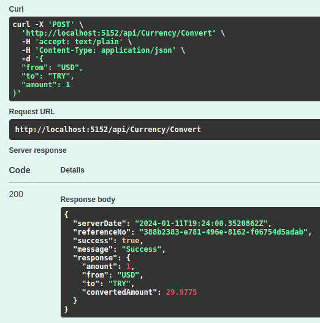
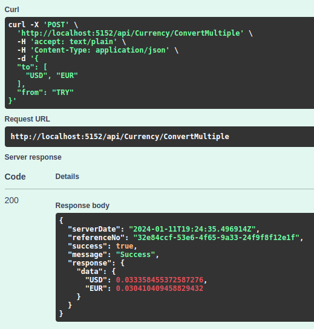
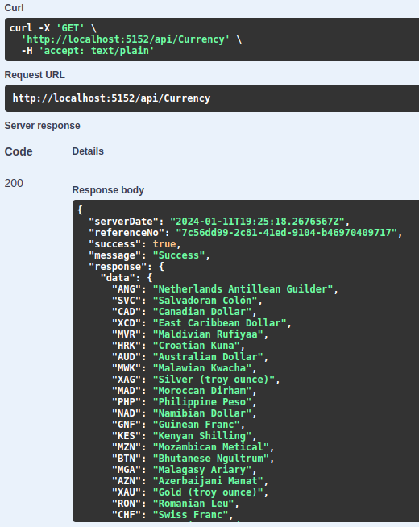
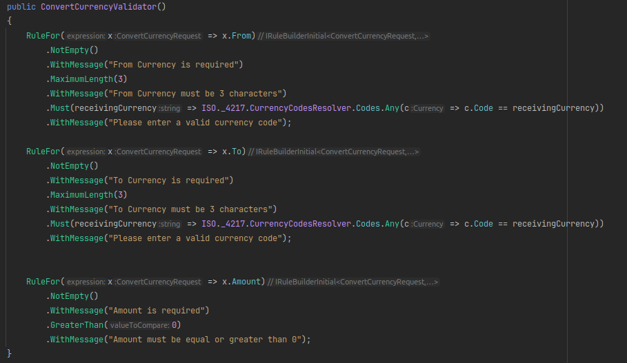
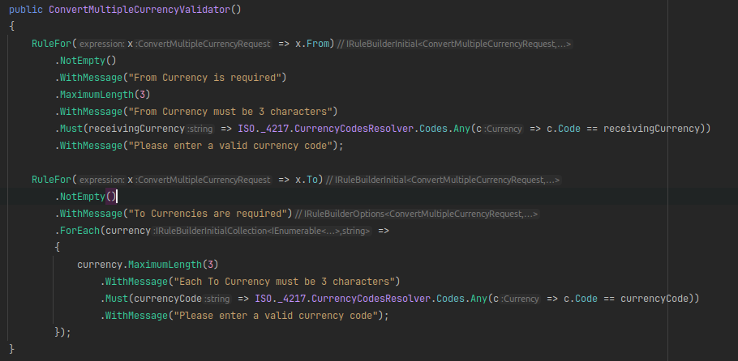

# Office Hour || Grup Proje Çalışması
## Currency App

## Case Detail

### -Herhangi bir online Api hizmetinden faydalanarak anlık kur bilgilerini sunan bir api seti hazırlayınız.

### -Seçtiğiniz Currency tipleri için seçtiğiniz Currecy tipine göre kur değerlerini getiren bir metod hazırlayınız. ✔️

### -Girilen tutar için A tipinden B tipine conversion yapan bir API geliştiriniz ( 10 USD -> 9 EUR etc.) ✔️

### -Desteklenen Currency tiplerini listeleyen bir api hazırlayınız. ✔️

## Notes

### -Swagger ya da Postman ekran görüntüleri eklensin. ✔️

### -Token, Key vb gibi harici bilgiler config'de kullanılsın ✔️

### -Hard coded ifadelere yer verilmesin ✔️

### -Proje .Net Core Web API projesi olarak teslim edilsin ✔️

### -İsimlendirmelere dikkat edilsin ✔️

## -Gerekli validasyonlar yazılsın ✔️

